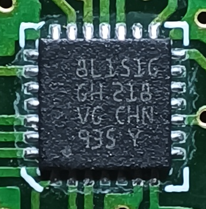
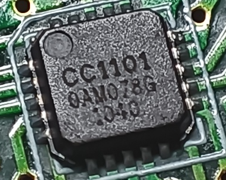
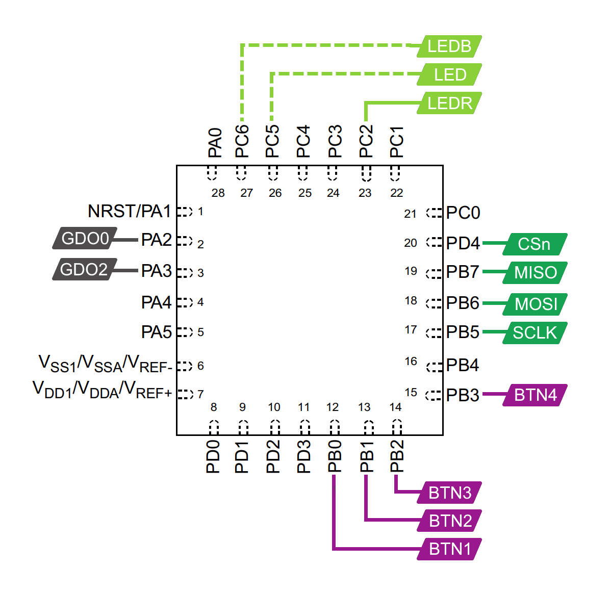

# STM8/CC1101 remote

This repo contains the hardware reversing and custom firmware for an STM8 and CC1101 based remote.

## Device

The remote has an *STM8L151* MCU and a TI *CC1101* sub 1 GHz transceiver. The radio chip has an out of spec 24MHz crystal (instead of a 26 or 27 MHz).

## Pinouts

There are 4 testpoints on the top left of the PCB, these can be used to flash the MCU. From left to right they are R (*nRST*), GND, S (*SWIM*) and +3V (the battery or 3.3V).

Notes:
* The blue LED (*LEDB*) is not populated on the board.
* *LED* can be either *LEDB* or *LEDR* depending on how the resistors are populated.
* The dashed lines mean they are not connected (components are not populated).
* *BTN1* is the top left button, *BTN2* is top right, *BTN3* is bottom left and *BTN4* is bottom right.
* SPI1 is connected to CC1101.

## Contents

* `docs/` contains documentation for the chips on the board.
* `sdcc/` contains SDCC. Not part of this repository.
* `src/` contains the source and [documentation](src/README.md) of the custom firmware for the remote.