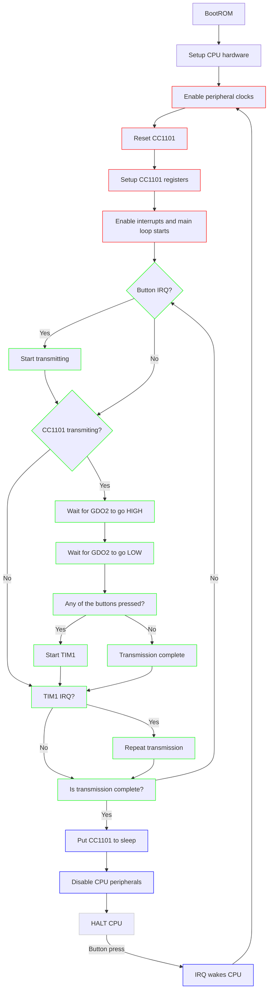
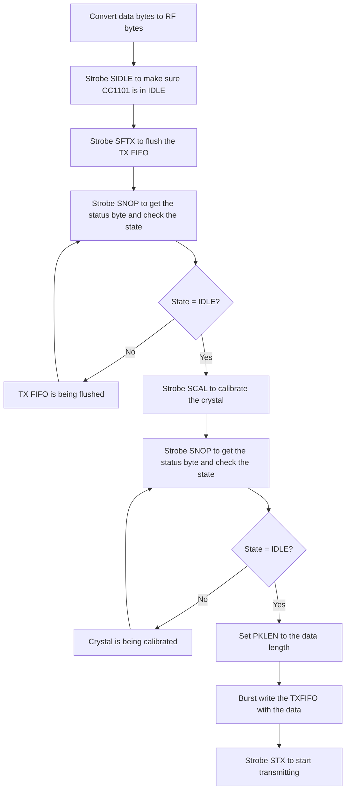

# Custom remote firmware

This firmware acomplishes a very simple task. It transmits 4 predefined codes as long as one of the 4 buttons on the remote is being held. Otherwise it puts everything to sleep to conserve battery.

## Compile and flash

The firmware uses SDCC to compile and STVP (ST Visual Programmer) to flash the STM8 chip.

Compiling can be done using `build.bat`

Flashing can be done using the GUI of STVP or the following commandline:

```
STVP_CmdLine.exe -no_loop -BoardName=ST-LINK -ProgMode=SWIM -Device=STM8L15xG4 -fileProg="build\remote.hex"
```

## How the firmware works

When the CPU boots up (by being powered from a battery) it sets up all the hardware (CPU registers, SPI, TIM1, GPIOs, IRQs), then it resets the CC1101 radio chip and the main loop starts.

The main loop first checks if a button interrupt had been triggered, if yes it sets up the CC1101 to transmit one of the 4 codes. Then GDO2 is being checked to see if the radio chip finished transmission, if it did and one of the 4 buttons is still being pressed TIM1 is used to wait for a while and transmit again. If none of the buttons are being pressed and there is no more data to be transmitted, the CPU puts the CC1101 to low power mode, disables its peripherals and halts until a button interrupt wakes it up.

The following graph shows the main steps of the firmware:



The following graph shows how the CC1101 is setup for transmission:



## CC1101 registers

SmartRF Studio 7 is used to setup most of the register values along with the datasheet. The frequency registers must be calculated by hand because SmartRF Studio only support 26MHz and 27MHz crystals.

After reset the following registers are set:

| Name | Value | Description |
| ---- | ----- | ----------- |
| IOCFG0 | 0x28 | Datasheet page 62, table 41 - GDO0 is set to CHIP_RDYn, non inverted. The default of this output is fosc / 192, for optimal RF performance this is set to any other non fosc state. |
| IOCFG2 | 0x06 | GDO2 asserts when TX begins and deasserts when the packet is fully transmitted. |
| PATABLE | [ 0x00, 0xC2 ] | In OOK mode PATABLE[0] is used to transmit '0' bits, and PATABLE[1] is used to transmit '1' bits. |
| FREQ0-1-2 | 0x12147A | This value is calculated using the formula given in the datasheet, taking the 24MHz crystal into consideration. |
| SYNC0-1 | 0x0000 | Sync word is not used. |
| CHANNR | 0x00 | Use the first channel ~ 433.92MHz. |
| FREND0 | 0x11 | Set PA power to 1. |
| MDMCFG0 | 0xF8 | Setup channel spacing. |
| MDMCFG1 | 0x02 | Channel spacing, No FEC, 0 preamble. |
| MDMCFG2 | 0x30 | Use ASK/OOK, no sync-word / preamble. |
| MDMCFG3-4 | 0xE5, 0x86 | Filter bandwidth and data rate. |
| PKTCTRL0 | 0x00 | No data whitening, No CRC, Packet is in FIFO, Fixed packet length (PKTLEN register). |

## Data conversion

This project uses ASK/OOK as data modulation but encodes the data into a short-long format. This means each '0' bit is transmitted as '100' and each '1' bit is transmitted as '110'. This makes it possible to transmit long strings of the same bits without the RF clocks drifting out of sync. Also this is the encoding used by V2 transmitters and receivers which makes it possible to use this project with V2 gate controllers.

For example `0xAB` (`0b1010 1011`) is encoded as `110 100 110 100 110 100 110 110` or `1101 0011 0100 1101 0011 0110` (nibble form) or `0xD3 0x4D 0x36`.
